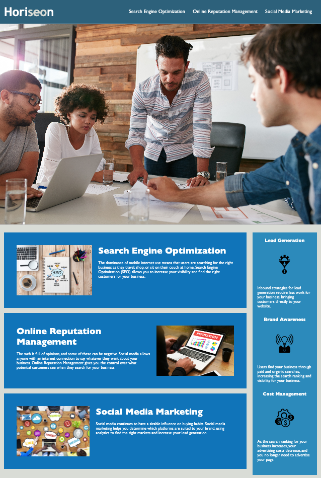

Horiseon Webpage Accessability and Semantics Refactoring

Link to deployed app: https://bryanborek.github.io/css-demo-site/
Link to the project Github: https://github.com/BryanBorek/css-demo-site

HTML has been replaced with semantic elements and commented for readability.
1. div's have been replaced with header, nav, body, main, article, aside, footer, where necessary. 
2. Footer was removed as the mockup did not include one. (it can be made visable again by removing comment symbols in the index.html)
3. Title has been uniquely defined as "Horieson SEO"

CSS has been majorly cleaned up reorganized, and commented.
1. Headings and general page styles organized together
2. Header and Nav Bar organized together 
3 Hero Image styles defined
4. Main Service styles cleaned up and organized
5. Benefits sidebar styles cleaned up and organized
6. Footer styles cleaned up and reorganized